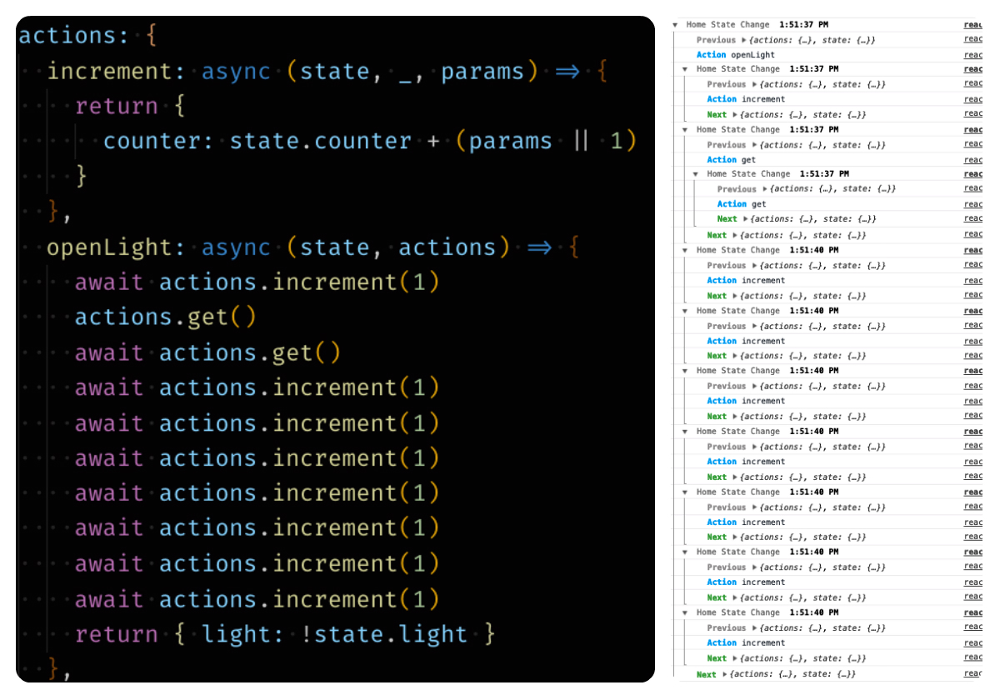

# react-modelx-experiment

The Demo for Next.js + react-modelx work around.

## How to run

```
npm i
npm run dev
```



## Feature used

- Base Api (useStore)
- SSR Support (asyncState, getInitialState)
- TS Support
- Redux Devtools
